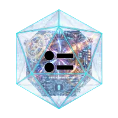
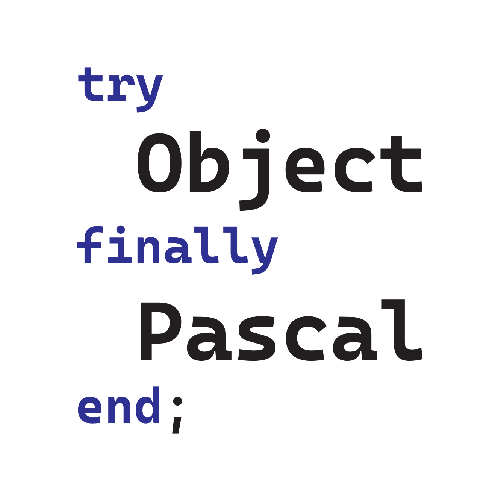

# Jim McKeeth Object Pascal Logo Proposals

Submitted by [Jim McKeeth](https://github.com/jimmckeeth)

I didn't make color variations, but just wanted to focus on shapes and letters. Changing colors is easy.

